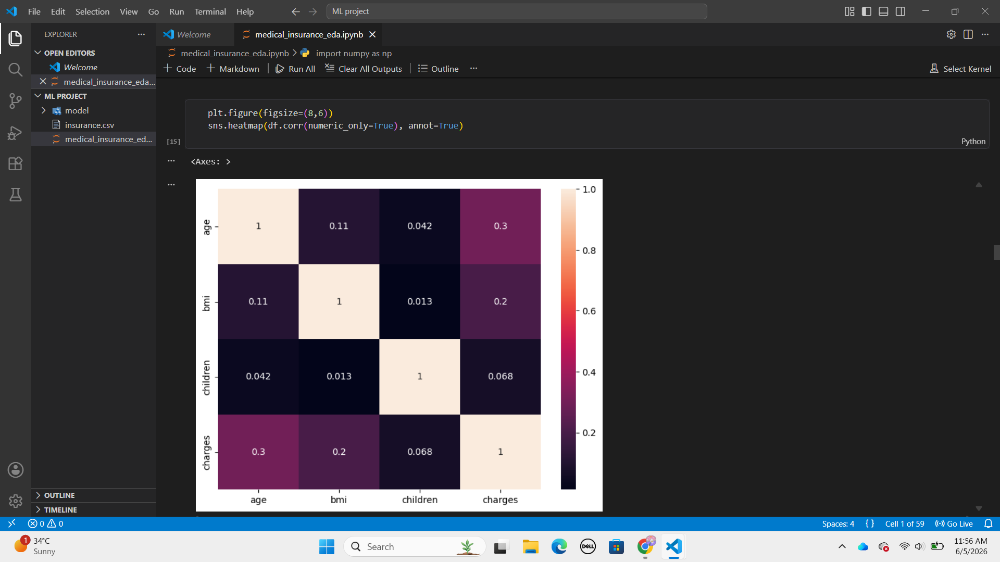

# Medical Insurance Cost Analysis 📊

This project performs Exploratory Data Analysis (EDA) and Feature Engineering on a medical insurance dataset to identify factors that influence insurance charges.

## Features

* Data Cleaning
* Missing Value Analysis
* Duplicate Removal
* Feature Engineering
* Data Visualization
* Correlation Analysis
* Chi-Square Testing
* Feature Scaling
* Feature Selection

## Technologies Used

* Python
* Pandas
* NumPy
* Matplotlib
* Scikit-Learn
* Jupyter Notebook

## Application Preview

## Key Insights

* Analyzed the relationship between age, BMI, smoking status, and insurance charges.
* Performed feature engineering to improve data understanding.
* Identified important factors affecting medical insurance costs.

## Files

* medical_insurance_eda.ipynb
* insurance.csv
* README.md

## Author

Mahnoor Khalid

Computer Science Student | AI & Machine Learning Enthusiast

